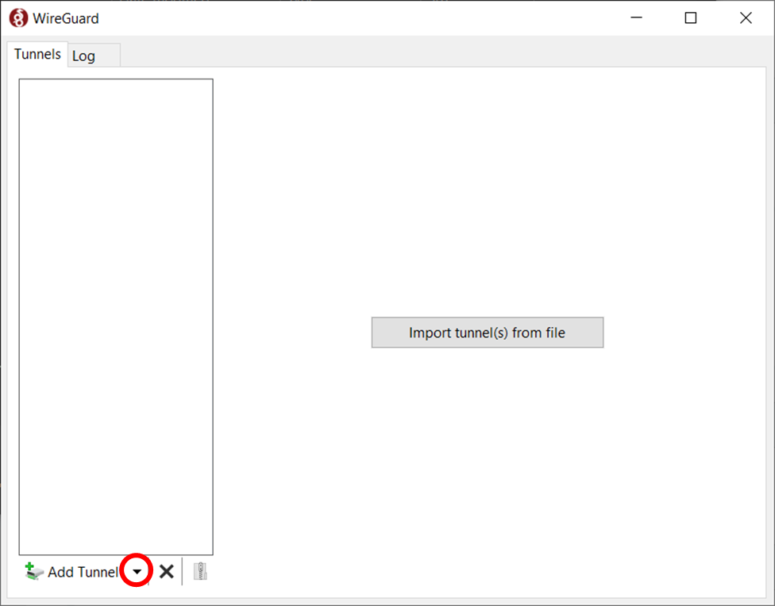
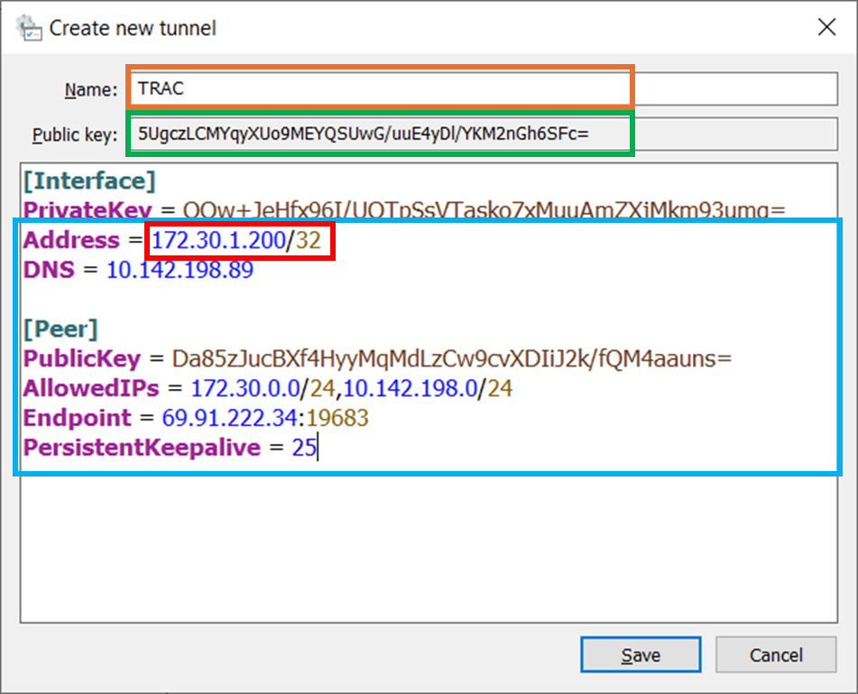

# Setting up your computer

## Windows users only, install WSL2

Windows Subsytem for Linux 2 gives you a linux interface on a Windows machine.
Follow the installation directions [here](https://learn.microsoft.com/en-us/windows/wsl/install).

## Install VS Code

VSCode is a well designed modern code editor developed and supported by Microsoft.
Follow the installation directions [here](https://code.visualstudio.com). (Windows
users should install the windows version, it works fine with WSL).

## Install PostgreSQL

PostgreSQL is an excellent open source SQL database, which is used to store the
ORCA data you will be using. Follow the install directions [here](https://postgresapp.com). 
If you're on windows, install the Linux version in WSL - we recommend version 16.2 to use
the same version as the main database. Be sure to install the command line tools (step 3) 
which are marked as optional.

## Install and setup Mamba

Mamba is a faster version of the Conda package and environment manager. We will
use it to manage our python environments and packages.
- If you do not already have a mamba/conda/anaconda installation, follow the installation directions for your system
[here](https://github.com/conda-forge/miniforge). Windows users should install
the Linux version in WSL.
    - When you run the install script, make sure you answer yes to letting it update
your `.bashrc` or `.bash_profile`.
- If you already have a conda or anaconda installation, you can replace `mamba`
with `conda` in all of the following commands, it will just be a little slower.
If you want it to be faster, you can follow the directions [here](https://www.anaconda.com/blog/a-faster-conda-for-a-growing-community) to install and use the faster
mamba solver in your conda installation.
- Create a yaml file to define the mamba environment you will use for this project.
You can start by copying [the example](orca.yaml) in this repo. I suggest storing
this yaml in your own git repo so that you have a backup of the yaml, you can keep
track of modifications and so you can replicate the environment on any machine.
- Create the environment by running `mamba create env -f <path_to_your_yaml>`.
- If at any point you want to add or remove a package from your mamba environment,
update the yaml and then run `mamba update env -f <path_to_your_yaml> --prune`.
Note that you can add packages to be installed by pip to this yaml if needed as well. 
Do not install any conda/mamba packages on the command line, always do it via the yaml.
- If for any reason your mamba environment develops a problem, you can quickly
and easily delete it using `mamba remove --name <your_env_name> --all` and remake
it using `mamba create env -f <path_to_your_yaml>`.
- Optionally add a line to your `.bashrc` or `.bash_profile` to automatically
activate your most commonly used mamba environment.
- Never install any packages in your base environment.

## Install and set up Wireguard

Wireguard is a modern Virtual Private Network (VPN) which facilitates secure 
connections between machines on different networks. Download and install the 
appropriate version of Wireguard for your machine from their [installation page](https://www.wireguard.com/install/).

*Figure 1: Main Wireguard Interface*

#### Configuration
1. Click the down arrow next to the "Add Tunnel" option in the lower left corner (circled in red in Figure 1) and choose "Add empty tunnel..."
2. In the box that pops up (Figure 2), give the tunnel a name (e.g., TRAC, in the orange box)
3. Copy the contents of the Public Key (Figure 2 green box) and email it to rpavery@uw.edu
4. Paste the VPN Details text below to the area under your PrivateKey (Figure 2 blue box)

        Address = 172.30.1.200/32
        DNS = 10.142.198.89
        
        [Peer]
        PublicKey = Da85zJucBXf4HyyMqMdLzCw9cvXDIiJ2k/fQM4aauns=
        AllowedIPs = 172.30.0.0/24,10.142.198.0/24
        Endpoint = 69.91.222.34:19683
        PersistentKeepalive = 25
6. Update the IP address (Figure 2 red box) to the address you get from Ryan
7. Click Save
8. Click the "Activate" button to connect to the VPN

*Figure 2: Wireguard Configuration Window*

If you cannot connect or have any other issue, please contact [Ryan Avery](mailto:rpavery@uw.edu).

## Database Credentials & Configuring PgCLI

Each of you will be given credentials to connect to the ORCA database. Your password will be 
provided directly in Slack as a private message. Many PostgreSQL clients support the 
[.pgpass file](https://www.postgresql.org/docs/current/libpq-pgpass.html) in your home 
directory as a way to automatically provide your password when connecting to the database. Use the steps below to create this file:

1. Create a file named `.pgpass` in your WSL home directory
2. Edit this file and add the following lines. The first line is a comment showing the
   syntax, and you should repace `<username>` and `<password>` with your credentials:

        #hostname:port:database:username:password
        10.142.198.170:5432:orca:<username>:<password>

3. Save the file and exit the editor
4. Edit the file to be readable only by you: `chmod 600 .pgpass`

PgCLI is a python package which is part of the orca.yaml file in this documentation. 
It is a command-line client that offers some features of IDEs like tab completion and 
intelli-type for regcognizing columns and database objects. To use the client to 
connect to a database, it is easiest to add shortcut entries, or Data Source Names (DSNs)
to the pgcli config file located in your home directory at `~/.config/pgcli/config`.

1. If you have not run pgcli before, type `pgcli` in a terminal window to create the configuration file
2. In WSL, use your favorite editor to edit ~/.config/pgcli/config
3. Find the `[alias_dsn]` section near the bottom
4. Underneath the example DSN, add the following config, replacing your `<username>` with your username:

        # example_dsn = postgresql://[user[:password]@][netloc][:port][/dbname]
        orca = postgresql://<username>@10.142.198.170:5432/orca

5. Save the file and exit the editor
6. Test if your connection works (ensure the Wireguard VPN is on) by entering the mamba
   python environment and typing `pgcli -D orca`. If it works, you will have a SQL prompt. 

## (Optional) Install DBeaver

Download and install the DBeaver Community version from [here](https://dbeaver.io). While not
necessary, doing so can be helpful for exploring the database structure and viewing
relationships between tables.
